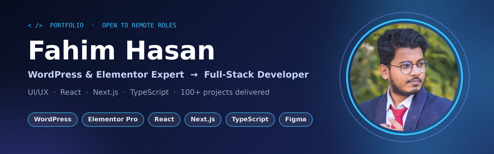
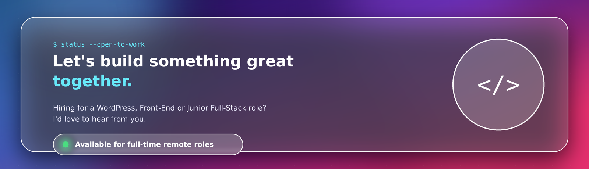

<!-- ===================== BANNER ===================== -->

  

  
  &nbsp;
  
  &nbsp;
  
  &nbsp;
  
  &nbsp;
  

Discord: <code>ifahimhasan</code> — search this username to add me

  

---

## 👋 About Me

I'm **Fahim Hasan**, a **WordPress Developer, Elementor Expert and UI/UX Designer** with **4+ years of remote experience** and **100+ projects** delivered for clients in the **UK, USA, Qatar and France**. I'm now growing into a **Full-Stack Developer** with **HTML5, CSS3, JavaScript, TypeScript, React and Next.js**.

I turn business requirements into fast, secure, SEO-friendly websites: hotel booking systems, e-commerce stores, SaaS platforms and business sites. I enjoy solving problems, and I like taking a design from Figma to a pixel-perfect, high-performance build.

- 🔭 **Currently:** WordPress Developer at **SEOSkit**
- 🌱 **Learning:** Full-Stack Development (React · Next.js · TypeScript, with backend and databases next)
- 🌍 **Working style:** remote-first, async-friendly, English communication, client-facing experience
- 🎯 **Looking for:** full-time **remote** Front-End / WordPress / Full-Stack roles with USA, UK and worldwide teams
- 🎓 **Education:** B.Sc. in Electrical & Electronic Engineering (EEE), American International University-Bangladesh

---

## 🛠️ Tech Stack

**Front-End & Modern Web** *(growing)*

  
  
  
  
  
  
  

**CMS, E-commerce & Design** *(core expertise)*

  
  
  
  
  
  
  

**Tools & Workflow**

  
  
  
  
  
  

| Area | Skills |
|---|---|
| **Languages** | HTML5, CSS3, JavaScript (ES6+), TypeScript, PHP (WordPress) |
| **Frameworks & Libraries** | React, Next.js, GSAP |
| **WordPress** | Elementor & Elementor Pro, custom theme customization, plugin integration, WooCommerce, hotel/booking systems |
| **E-commerce** | WooCommerce, Shopify store design & development |
| **Design** | UI/UX design, Figma, responsive and mobile-first design, design systems |
| **Performance & SEO** | On-page SEO, Core Web Vitals, speed optimization, caching, image optimization |
| **Security** | WordPress hardening, malware cleanup, backups, security setup |
| **Tools** | Git, GitHub, VS Code, Chrome DevTools, cPanel, phpMyAdmin |
| **Soft skills** | Team leadership, client communication, problem-solving, remote collaboration |

> 🚀 **Next on my roadmap:** Node.js, Express, REST APIs, MongoDB / PostgreSQL, authentication, testing, deployment (Vercel), CI/CD

---

## 🎓 Certifications & Courses

| Course | Institute | Year |
|---|---|---|
| **WordPress & Shopify** | CodemanBD | 2022 – 2023 |
| **SEO** | Mentored by top-rated SEO expert Hridoy Chowdhury | 2023 |
| **Digital Marketing** | UY Lab | 2024 |
| **UI/UX Design** | Ostad | 2024 – 2025 |
| **Full-Stack Web Development** | Programming Hero | 2026 – Running |

---

## 💼 Professional Experience

### 🔹 WordPress Developer: **SEOSkit** *(1+ year, ongoing)*
- Building and maintaining WordPress sites, with a focus on speed, SEO and conversion.

### 🔹 WordPress Developer (Part-time): **Arteousbd**
- Delivering WordPress and Elementor builds alongside full-time work.

### 🔹 Elementor Expert: **Ruwaifi Studio Ltd** *(project-based, ~6 months)*
- Designed and developed custom Elementor Pro websites from design briefs.

### 🔹 WordPress & UI/UX Designer, Team Leader (Remote): **RankUp, UK** *(~3 years)*
- Worked remotely in the dev team of a top-rated freelancer / SEO expert, delivering projects for international clients.
- Led work across design, development, SEO, speed optimization, security and malware cleanup.

### 🔹 Customer Support Associate: **ShopUp** and **Grameenphone Bangladesh** *(~1 year 8 months)*
- Live chat and email support. Built the communication, empathy and problem-solving skills I now bring to client work.

---

## 🌟 Selected Work

> 💡 *Client work spans hotel booking systems, e-commerce, business/portfolio sites and SaaS platforms.*

| Project type | What I built | Stack |
|---|---|---|
| 🏨 **Hotel Booking Website** (Qatar) | Booking system with integrations, responsive UI | WordPress, Elementor Pro |
| 🛒 **E-commerce Stores** | Product catalog, checkout, speed and SEO tuning | WooCommerce, Shopify |
| 🏢 **Business & Portfolio Sites** | Brand-focused, conversion-driven websites | WordPress, Elementor, Figma |
| 💻 **SaaS Landing Pages** | Clean UI/UX and high-performance pages | WordPress, Figma |
| ⚛️ **Front-End Practice Projects** | Learning-in-public builds *(add repo links below)* | React, Next.js, TypeScript |

<!-- Replace with real repos as you build them, e.g.
### 📌 Pinned: project-name
Short one-line description · Live demo · Tech: React, Next.js, TypeScript
-->

👉 **Full project list (live links):** [View my project spreadsheet](https://docs.google.com/spreadsheets/d/1hH4pFqyzEdQ1pDde87K133O_L2zoazILiXIWUjPbnsE/edit?gid=0#gid=0) · [ifahimhasan.com](https://ifahimhasan.com)

---

## 📈 What I Bring to a Team

- ✅ **Speed and SEO by default:** fast-loading, search-friendly builds
- ✅ **Design + code:** I move from Figma to production without hand-off friction
- ✅ **Client-proven:** 100+ projects with international clients across 4 countries
- ✅ **Leadership:** team lead experience in a remote setting
- ✅ **Growth mindset:** actively leveling up into modern JavaScript, TypeScript, React and Next.js  

---

## 📊 GitHub Stats

  
  

  

Stats load live from GitHub — if a card looks empty right after publishing, refresh in a few seconds.

---

## 🤝 Let's Work Together

  

  
  &nbsp;
  
  &nbsp;
  
  &nbsp;
  

  

<!--
KEYWORDS (SEO): Fahim Hasan, WordPress Developer, Elementor Expert, Elementor Pro, Front-End Developer,
React Developer, Next.js Developer, TypeScript, JavaScript, HTML5, CSS3, Full-Stack Developer, UI/UX Designer,
Figma, WooCommerce, Shopify, Website Speed Optimization, WordPress SEO, Remote Developer, Bangladesh
-->
